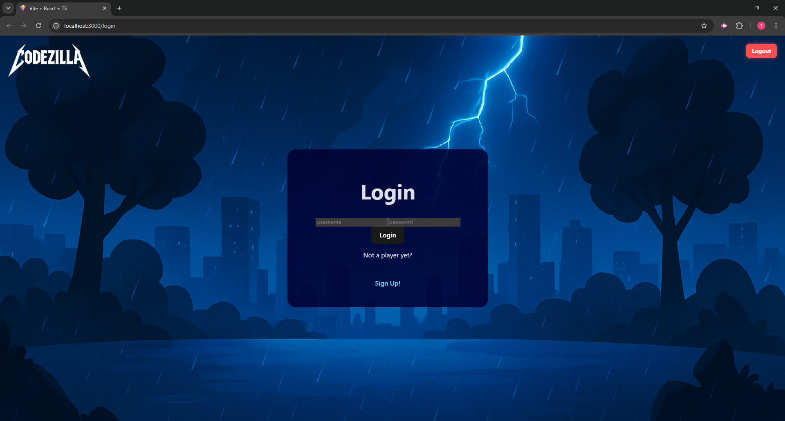
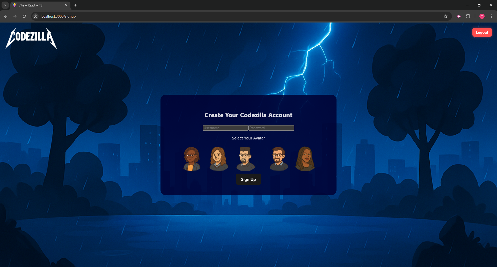
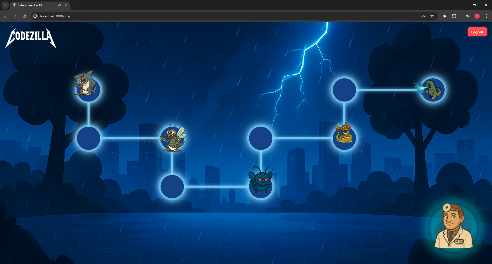
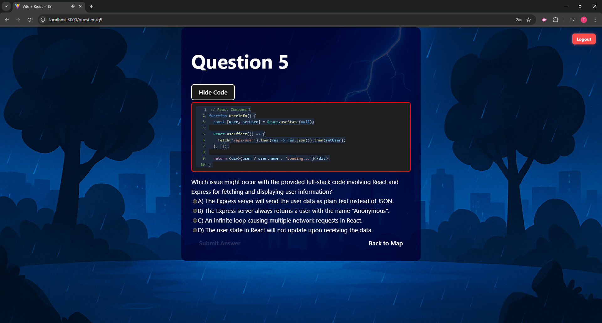
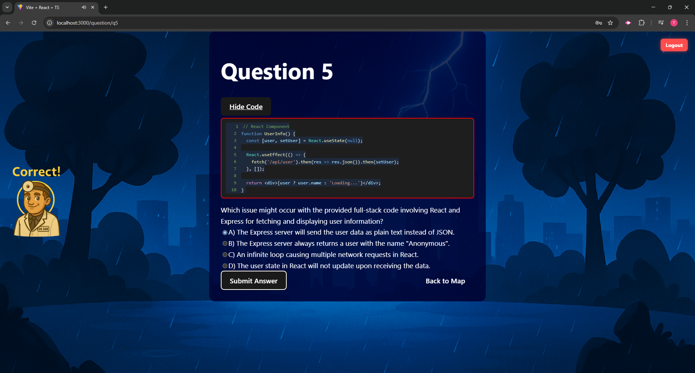
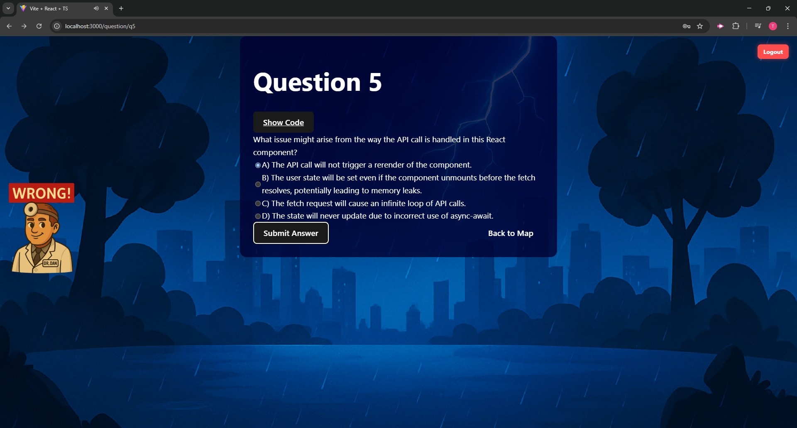
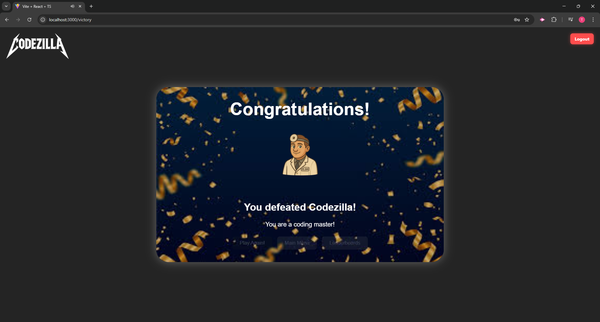
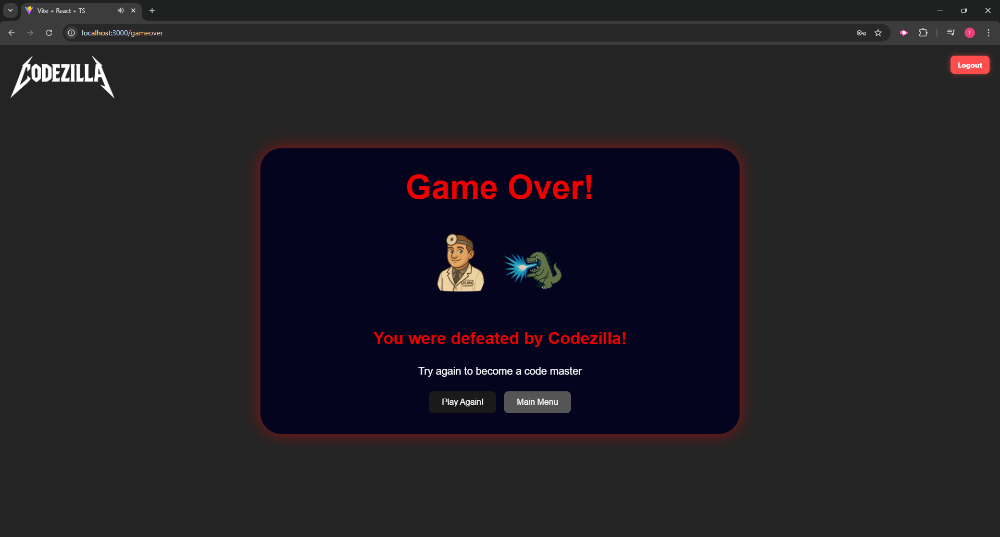
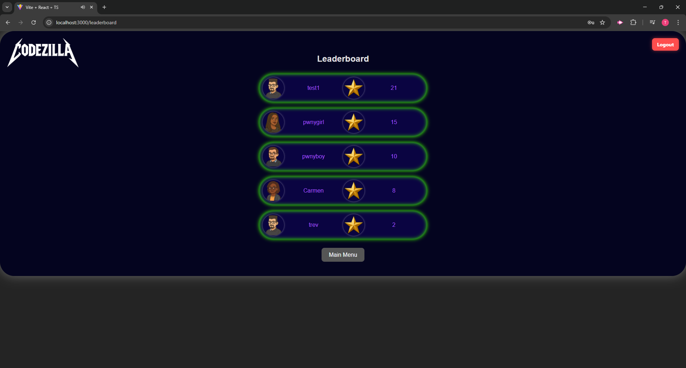

# Codezilla


## 🧠 Description
**Codezilla** is a full-stack MERN application that blends gameplay and AI to create a coding challenge experience like no other. Players log in, traverse a vibrant game map, and face off against AI-generated coding questions. Each battle—whether with quirky minions or the mighty Codezilla—is powered by OpenAI. Your coding accuracy and speed determine your fate, and the leaderboard showcases top contenders from around the globe.

## 📚 Table of Contents
- [Installation](#installation)
- [Usage](#usage)
- [Technologies](#technologies)
- [Screenshots](#screenshots)
- [Walkthrough Video](#walkthrough-video)
- [Live Site](#live-site)
- [Contributors](#contributors)
- [Tests](#tests)
- [License](#license)
- [Contact](#contact)

## ⚙️ Installation
```bash
# Clone the repo
git clone https://github.com/OutsideofemiT/Codezilla.git

# Navigate into the project directory
cd Codezilla

# Install dependencies (run separately in /client and /server if monorepo)
npm install

# Build the app
npm run build

# Start the app
npm run start
```

## 🚀 Usage
1. Sign up or log in from the landing page.
2. Explore the interactive world map.
3. Click on a boss to start a coding challenge.
4. Answer the AI-generated question to advance.
5. Conquer Codezilla and claim your place on the leaderboard.

## 💻 Technologies

### Frontend
- 
- 
- 
- 
- 

### Backend
- 
- 
- 
- 
- 
- 

### Development Tools
- 
- 
- 
- 

## 🖼️ Screenshots

- **Login Page**
  

- **Sign-Up Page**
  

- **Game Map**
  

- **Questions Page**
  

- **Correct Answer – Dr. Dan Response**
  

- **Wrong Answer – Dr. Dan Response**
  

- **Victory Screen**
  

- **Defeated Screen**
  

- **Leaderboard Page**
  

## 🌐 Live Site
[Codezilla on Render](https://codezilla-fnqd.onrender.com/)

## 👥 Contributors
Special thanks to the team behind Codezilla:
- **Carmen Wheeler**
- Jacquilyn Fletcher
- Shawna Chrillo
- Michael Mangieri
- Trevor Moore

## 🧪 Tests
No automated tests are implemented yet. Future updates may include Cypress tests and unit testing.

## 📄 License
This project is licensed under the MIT License.

## 📬 Contact
Have questions, feedback, or want to collaborate?
- GitHub: [@OutsideofemiT](https://github.com/OutsideofemiT)
- Email: carmenwh33l3r@gmail.com